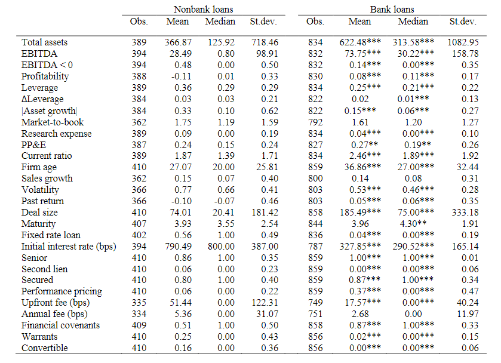

# [Non-bank lending (2019)](https://www.nber.org/papers/w26458.pdf)

> Overall, our results  suggest  that  bank  and  nonbank  lenders  may  utilize different lending techniques and specialize in lending to different types of borrowers or to finance different types of projects.

