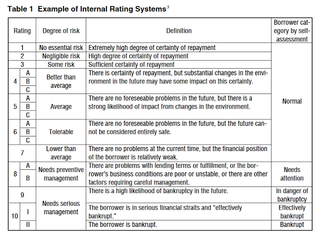
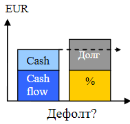

# Illustrations

### Schematic balance sheet

[source](https://eba.europa.eu/risk-analysis-and-data/eu-wide-transparency-exercise)

### IFRS-9 reserves

[source](https://voxeu.org/article/loan-valuations-age-expected-loss-provisioning)

### VaR for credit losses

### Loan categories

[source](https://www.imes.boj.or.jp/english/publication/mes/2000/me18-2-3.pdf)

## Cash vs debt service

[source](https://mgimo.ru/files/238488/project_financing_13.pdf)