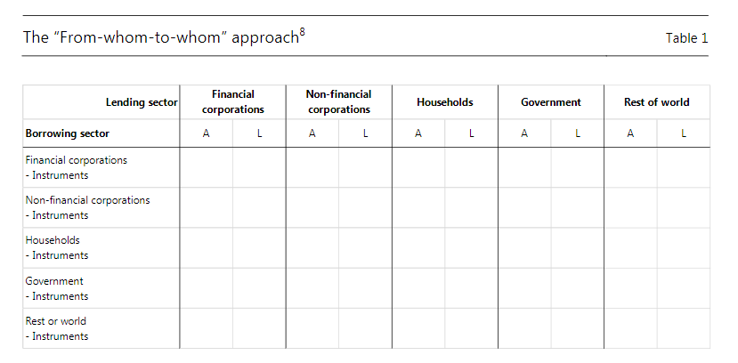

## Flow of funds (FoF)

Introductory notes:

- part of or extenstion of system of national accounts (link to [SNA refresher](https://epogrebnyak.github.io/sna-ru/handout/index.html)):  
  `gross savings = fixed cap investment + net lending + stat discrepancy`
- balance sheet (stock) and transaction (flows) tables
- sectors x instruments table (*'2d'*), sectors x instruments x sectors table (*'3d'*)
- valuation at market prices (different view on book value in corporate reports)
- `closing stock = opening stock + flow + revaluation + other changes (eg. writeoff)`

Expected takeaways:

- bank-based (loan) vs market-based (bonds) financial system
- size of corporate debt (loans and bonds)
- more debt instruments (several types of loans, trade credit)
- cautious about:
  - equity shows at market, not book value 
  - aggregation vs consolidation of exposures
  - nonfinancial sector net position (net worth)
- discussion on what is missing in FoF statistics and where to find it

Suggested reading (methodology): [Development of financial sectoral accounts. New opportunities and challenges for supporting financial stability analysis by Bruno Tissot November 2016. BIS/IFC](https://www.bis.org/ifc/publ/ifcwork15.pdf)

### Excercise

[Excel file](fof.xls) (links inside):

- US
- Euro area
- Japan
- Russia

### Interactive example: UK 

Sector-to-sector instrument matrix ('3d'), [link](https://www.ons.gov.uk/economy/nationalaccounts/uksectoraccounts/articles/transformingtheukfinancialaccountsflowoffunds/2019-11-26#the-flow-of-funds-framework)

To discuss: how does chart below prove UK is an international finance center?

<iframe height="908px" width="100%" src="https://www.ons.gov.uk/visualisations/dvc697a/index.html"></iframe>